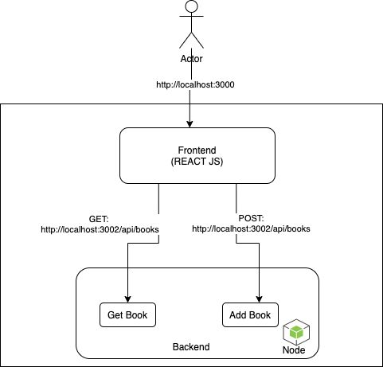

## Book List Application (React + Node.js API)

This project consists of a React frontend and a simple Node.js Express backend using in-memory data for a dynamic book list. The frontend fetches and posts data to the backend via a REST API.

### Architecture



### Prerequisites

You need the following installed:

- Node.js (version 18+)
- npm (comes with Node.js)
- Docker and Docker Compose (for containerized setup)

### 1. Running Locally (Without Docker)

This is the fastest way to get started if you have Node.js installed.

**Step 1: Install Dependencies**

Navigate to the project root and install express and cors (as defined in package.json).

`npm install`

**Step 2: Start the Backend API Server**

The API will run on http://localhost:3002.

`node server/server_books.js`

You should see the message: `Books API Server running at http://localhost:3002`

**Step 3: Start the React Frontend**

The React component (App.js) is ready to run directly in the environment it is displayed in. It will automatically connect to http://localhost:3002.

If you were running this on your local machine with a standard React setup (like one created with create-react-app), you would run:

```
# This command is for a full local setup, not needed in this Canvas environment
export REACT_APP_API_HOST=http://localhost:3002
npm run start:frontend
```

### 2. Running with Docker Compose (Recommended)

This method builds and runs both the frontend and backend services in isolated containers, ensuring a consistent environment.

**Step 1: Build and Run Services**

From the directory containing docker-compose.yml, run the following command. This will build the images and start the containers.

`docker-compose up --build`

**Step 2: Access the Application**

1. Backend API: Running inside the container at port 3002. You can access it from your host machine at http://localhost:3002/api/books.

2. Frontend App: For this specific setup, you should view the rendered App.jsx in your environment, which will automatically communicate with the backend service name resolved by Docker Compose.

**Step 3: Stop the Services**

To stop and remove the containers, run:

`docker-compose down`

**Docker Compose Service Details**.
||||||
|---|---|---|---|---|
|Service|Dockerfile|Host Port|Container Port|Purpose|
|backend|Dockerfile.backend|3002|3002|Node.js API server (In-Memory Data)|
|frontend|Dockerfile.frontend|3000|3000|React Development Environment|
